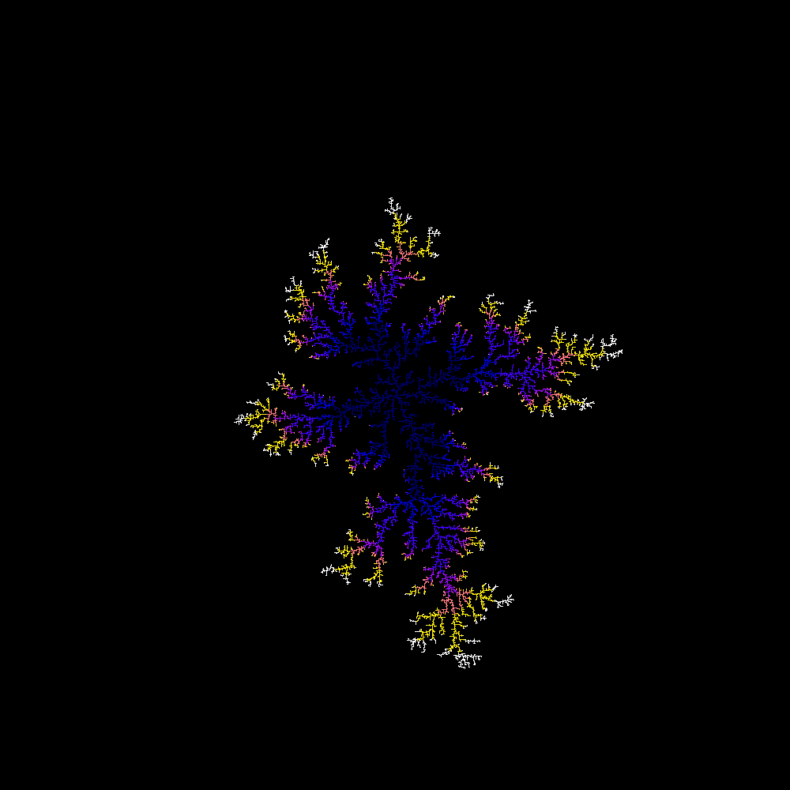
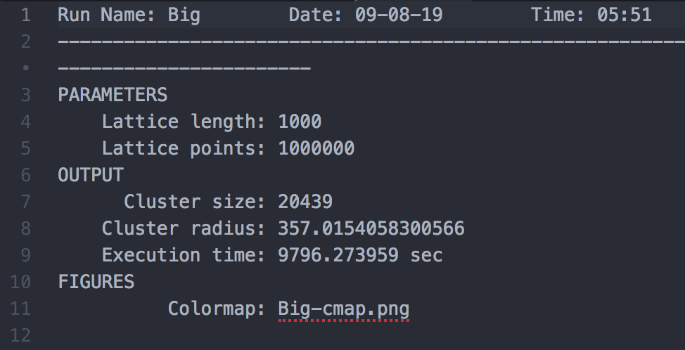

## Diffusion-limited Aggregation (DLA) Simulation

---

The program consists of two components:
1. Directory and file management system
1. 2D DLA simulation of dendritic growth

### Background

Subject to conditions, complicated structures, such as snowflakes, can grow. This is in spite of a relatively simple growth process.

In the case of snowflakes, adjacent water molecules attach to an initial nucleus. This reduces the pressure surrounding the snowflake. Equilibrium is achieved by water molecules diffusing into this region and hence increasing the size of the structure.

DLA simulates (i) the random motion of particles (diffusion) and, (ii) growth is proportional to particle flux. It can also be used to study fractal geometry (not currently implemented).

### Implementation

The DLA process is simulated via:

1. Nucleus placed at centre of 2D lattice.
1. New particle spawned at a random point on a circle with a radius rStart, which is larger than the cluster radius, rCluster.
1. Particle randomly moved until adjacent to the cluster, then stick. Alternatively, if the particle moves out of some other circle of radius rOuter, then remove and spawn a new particle.
1. Continuously update rCluster, rStart and rOuter as the cluster increases in size.

Note, the colour of the particles change throughout the simulation to represent the time evolution of particle deposition.

### Example

To execute:

``` python
python dla.py
```

Input __runName__ and lattice __length__. Within the newly created __runName__ directory will be two files. One containing simulation run information and the other a PNG of the cluster.

PNG file: <br/>


DATA file: <br/>


### Authors

- A Gregory

### Acknowledgements

- M Probert, University of York
